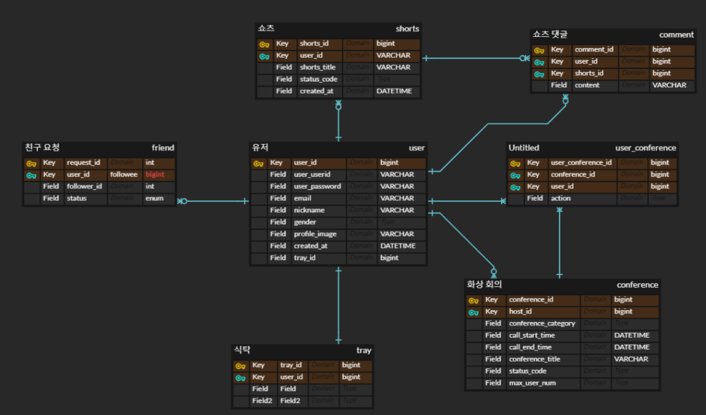

### ERD 설계

**설계 고민사항**

- 방에 대한 정보를 디비에 어떻게 저장할지 → 코치님 조언대로 작성

- 참여 인원이 인원 제한을 넘기면 어떻게 할지 (동시에 여러 명이 방에 접속한다거나)

- 이미지, 영상 관리 : S3 활용

- 친구 요청을 서로 보내는 상황도 일어나는가? → 친구 요청 status_code로 관리

- notification 테이블이 필요한가? (친구 요청, 수락, 거절, …) → friend 테이블에 isRead 컬럼 추가하여 해결

- 식당 개념은 conference에 컬럼으로 추가하는지, pagination같은 기능인지 → 고민 중

- conference에 음식 태그 추가하기

- 회원 프로필 : 프로필 이미지, 한줄자기소개, 식탁 앨범, (쇼츠 페이지? 커스텀 말풍선?) 추가하기

- user_tray는 필요없고 tray에 놓일 아이템(이미지) 저장할 테이블 필요 (음식, 수저, 테이블보, …)
